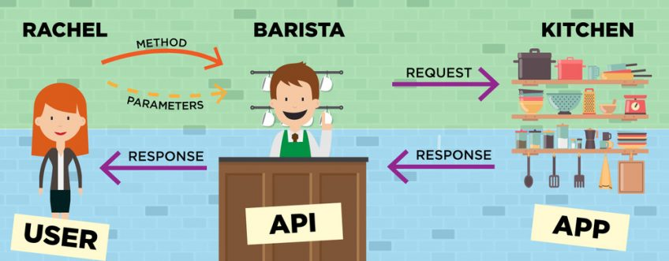
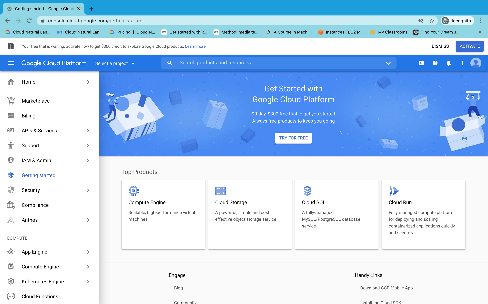
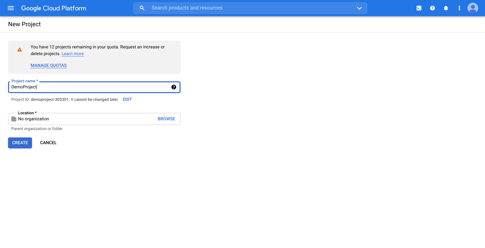
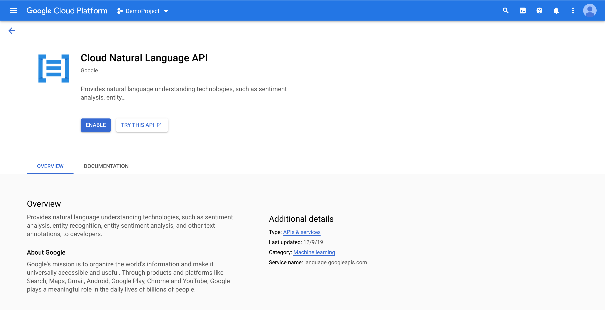
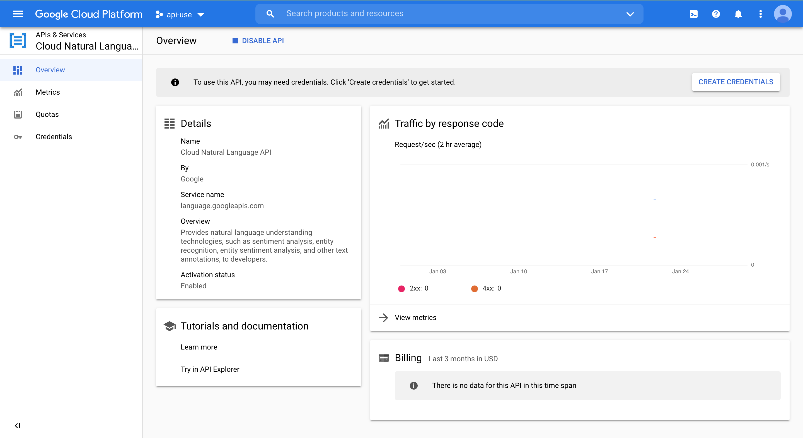
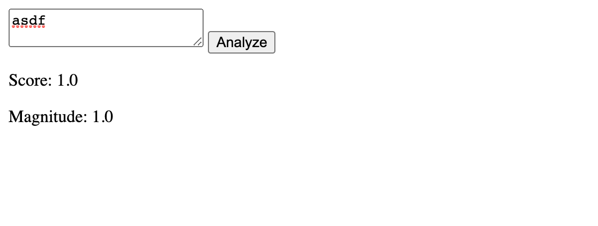
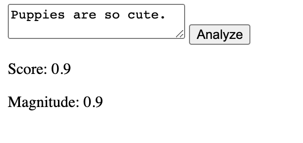
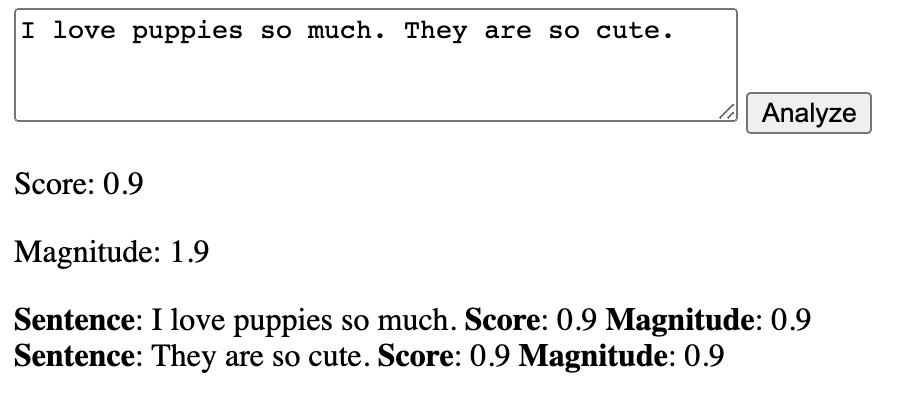

# HOTH (Hack off the Hill) Web API Workshop

**Date:** February 5

**Teachers:** Timothy Rediehs

**Slides:** TODO

**Link to the Google Natural Language API:** https://cloud.google.com/natural-language/?hl=en_US

## What Are We Learning
* What is an API?
* Now what is a **Web** API
  * When do we use them?
* How Do We Talk to Web APIs
  * **JSON**
  * There are other ways as well
* Setting up Google Natural Language API
* Using Google Natural Language API

## What is an API?
In a lot of cases, we want to ask another program to perform a task or give us information. The big question is **how do we write a program that tells another program to do something?** The purpose of an API (Application Program Interface) is to tell you how to talk to another program. For example, Linux provides the `open()` system call to open files. This is part of Linux's API. Even though you probably didn't write the Linux kernel, you can still use it though it's API. 

One way to think of an API is like a barista at a coffee shop. When you go to a coffee shop, you can simply tell the barista what you want, and they will make it for you. The barista is the interface between you and the coffee shop. This is really good because...
1. You don't have to know how to make your drink
2. The barista can control how you get coffee (for example, you have to pay)



## What is a Web API
A web API is just another type of API. Specifically, this API is accessed over the internet. For example, I might use an API to send a word to [dictionary.com](https://www.dictionary.com/) and receive it's definition.

## How To Talk to (Web) APIs
### Part 1: HTTP
The Hyper Text Transfer Protocol (HTTP) is the primary way we communicate over the World Wide Web. There are a few things to know about HTTP in order to make web requests.
* **URL**
  * Think of this as the URL that you put into your web browser... because a lot of times it actually is. The path tells who your request is for, what you are asking for, and optionally extra parameters
  * Take the following: `https://api.scryfall.com/cards/named?fuzzy=negate`
    * I am asking Scryfall (`api.scryfall.com`: **host**) for a to tell me give me a Magic: The Gathering card that matches a name (`cards/named`: **path**). Specifically, I'm looking for Negate (`?fuzzy=negate`: **query parameter**).
* **HTTP Methods**
  * Two of the most common HTTP methods you will see are `GET` and `POST`. Usually, `GET` is for simple requests like retrieving a webpage or resource. `POST` is usually for submitting some information to a site. For example, if you wanted to tell Twitter to make a new Tweet, you would probably use a `POST` request.
* **Request Headers**
  * Sometimes, we want to add some extra information to our request. A common one in `POST` requests is `Content-Type` which is how you tell a server what kind of data you are giving it. If you are sending JSON, you will add the key-value pair `Content-Type: "application/json"` to your request headers.
  * Cookies and Authetication information are often placed in the headers as well.

### Part 2: JSON
JSON stands for JavaScript Object Notation. What this does is allow us to send and receive data in a way that both the server and user can use and understand. JSON works for any programming language, making it super versatile and useful.

JSON is structured in key-value pairs as shown below

```json
{
	"some_key": "some value",
	"a_number": 4,
	"a_boolean": true,
	"a_json": {
		"TimIsCool": true
	}
}
```

In JavaScript, we can manipulate JSON by adding, changing, and removing keys.

```js
// Notice that, in JavaScript, we can write the key name with or without the quotes
const myJSON = {
	favoriteNumber: 4,
	"First Name": "Tim"
}

// CHANGE VALUE
myJSON.favoriteNumber = 5;
myJSON["First Name"] = "Timothy";
console.log(myJSON);
// Output: {"favoriteNumber": 5, "First Name": "Timothy"}

// REMOVE VALUE
delete myJSON["First Name"];
console.log(myJSON);
// Output: {"favoriteNumber": 5}

// ADD NEW VALUE
myJSON.firstName = "Tim";
console.log(myJson);
// Output: {"favoriteNumber": 5, "firstName": "Tim"}
```

## Basic API Request Using JavaScript
One of the easiest things to do with an API is to ask for information. JavaScript provides a very nice way of doing this: the `fetch()` function.

Can you name a random Magic: The Gathering card? Neither can I, but Scryfall can. We can get a random card with the following JavaScript.

```js
const res = await fetch("https://api.scryfall.com/cards/random");
const json = await res.json();
console.log(json);
```
> Tip: If you type Option + ⌘ + J (on macOS), or Shift + CTRL + J (on Windows/Linux), you can open Chrome's JavaScript console. Try this code there and see what happens!

If we run this, we get a chunky JSON back (I've shortened it significantly). It looks like I ended up getting a card named "Colossal Dreadmaw", but you might get a different one.

```json
{
	"object":"card",
	"id":"8059c52b-5d25-4052-b48a-e9e219a7a546",
	"name":"Colossal Dreadmaw",
	"mana_cost":"{4}{G}{G}",
	"cmc":6,
	"type_line":"Creature — Dinosaur",
	"oracle_text":"Trample (This creature can deal excess combat damage to the player or planeswalker it's attacking.)",
	"power":"6",
	"toughness":"6",
	"colors":["G"],
	"color_identity":["G"],
	"keywords":["Trample"],
	"games":["arena","paper","mtgo"],
	"set":"m21",
	"set_name":"Core Set 2021",
	"set_type":"core",
	"rarity":"common",
	"flavor_text":"If you feel the ground quake, run. If you hear its bellow, flee. If you see its teeth, it's too late.",
	"artist":"Jesper Ejsing",
	"border_color":"black"
}
```

## Setting Up Google Natural Language API
⚠ IMPORTANT DISCLAIMER: Although light use of this API is free, you'll need a credit card to set up billing anyways. See [here](https://cloud.google.com/natural-language/pricing) for more pricing information.

While getting random Magic: The Gathering cards is a good introduction to APIs, we can be ✨flashier✨.

**Nothing says "hackathon" like a flashy ML project**

Google has several APIs that are available for use. The one I'll use is their Natural Language API. The goal is to give Google a piece of text, and Google can tell us if it seems to have a positive or negative mood.

Follow these steps to get set up:
* Go to: https://console.cloud.google.com/



* **Sign in** with your Google account (make one if you don't have one)
* **Create a new project** by selecting the "Select a project" dropdown menu.
  * In the resulting pop up, select the "New Project" button on the top right.
  * Enter a name for you project and click Create



* Select your new project using the dropdown at the top left.
* In the search bar, **search "Cloud Natural Language API"** and click on the "Cloud Natural Language API" result
  * The resulting page will link to useful documentation, as well as the "[Learn More](https://www.google.com/url?q=https%3A%2F%2Fcloud.google.com%2Fnatural-language%2F%3Fhl%3Den_US)" link which takes you to a small demo.
* Click the "Enable" button. If you haven't set up **billing**, it will now bother you about that with a "Billing Required" pop up. You should 
  * Click "Enable Billing", then "Create Billing Account"
  * Fill in the resulting information.
    * Feel free to start a free trial if you want. This will give you $300 in free credits if you anticipate that you will need it.



* After setting up billing, you should be able to enable the API using the same button from the previous step.
* This should take you to an overview page for the API.



* Now, you just need to set up **credentials**. In our case, an **API Key** (An API key is a secret between you and Google that you will show Google when you make your request to prove you are you).
  * Click **Credentials** on the left menu, then click "+ Create Credentials" on the top of the page.
  * Select API Key
  * Select Restrict Key (this will take you to a new page)
  * Under "API restrictions" select "restrict key", then, from the drop down, select "Cloud Natural Language API"
  * Click the Save button
  * You will use this API key to make requests

⚠️ VERY SERIOUS SECURITY INFO: Your API key is a **secret**. Treat it like a password. Here are some [API key best practices](https://support.google.com/googleapi/answer/6310037?hl=en).

## Using the Natural Language API
First things first, [here are the docs](https://cloud.google.com/natural-language/docs/apis). This is a great source of information and may help fill in gaps. We will be using the [analyze sentiment endpoint](https://cloud.google.com/natural-language/docs/reference/rest/v1/documents/analyzeSentiment).

There are lots of ways to actually use an API. I'll choose to use HTML and JS because it let's us make a user interface easily, but you could make an API request from Python, C++, Java, Go, and a range of other languages. Without further ado, take the following starter HTML that creates a very basic page:

```html
<!DOCTYPE html>
<html lang="en">
<head>
	<meta charset="UTF-8">
	<meta name="viewport" content="width=device-width, initial-scale=1.0">
	<title>Document</title>
</head>
	<script>
		async function displaySentiment(){
			// Find the html elements I want to change
			const text = document.getElementById("main-text").value;
			const scoreElement = document.getElementById("score");
			const magnitudeElement = document.getElementById("magnitude");
			// TODO: (API) Ask google if the text inside our textbox has a positive or negative tone.
			// Set the text of the two elements
			scoreElement.innerHTML = "1.0";
			magnitudeElement.innerHTML = "1.0";
		}
	</script>
<body>
	<div id="input">
		<textarea id="main-text"></textarea>
		<button onclick="displaySentiment()">Analyze</button>
	</div>
	<div id="overall-sentiment">
		<p>Score: <span id="score"></span></p>
		<p>Magnitude: <span id="magnitude"></span></p>
	</div>
	<div id="sentence-sentiment">

	</div>
</body>
</html>
```


The idea is that pressing the Analyse button will give a score from -1 to 1 of how **positive** the text is, and a magnitude of 0 to 1 of how sure we are of the score. However, I don't know how to do this on my own, and am just guessing that it's very positive. Let's try using the Google API instead. We will write a new function called `getSentiment(text)` that will return Google's response.

```html
<script>
	const googleApiUrl = `https://language.googleapis.com/v1/documents:analyzeSentiment?key=YOUR_API_KEY`;
	async function getSentiment(text){
		const doc = {
			"document":{
				"type":"PLAIN_TEXT",
				"content": text,
			},
			"encodingType": "UTF8"
		}
		const res = await fetch(
			googleApiUrl, 
			{
				method: "POST", 
				// Blob? Why? We convert our doc to a Blob because Google expects it that way (not as a normal object)
				body: new Blob([JSON.stringify(doc)]),
				headers: {
					'Content-Type': 'application/json'
				}
			}
		);
		const json = await res.json();
		return json;
	}
	async function displaySentiment(){
		// Find the html elements I want to change
		const text = document.getElementById("main-text").value;
		const scoreElement = document.getElementById("score");
		const magnitudeElement = document.getElementById("magnitude");
		// TODO: (API) Ask google if the text inside our textbox has a positive or negative tone.
		// Set the text of the two elements
		scoreElement.innerHTML = "1.0";
		magnitudeElement.innerHTML = "1.0";
	}
</script>
```

Our new `getSentiment` is simply making a request to Google and returning it. We are building the [request body](https://cloud.google.com/natural-language/docs/reference/rest/v1/documents/analyzeSentiment#request-body) that the API documentation asks us to make. 

```ts
// Request Body
{
  "document": {
    object(Document)
  },
  "encodingType": enum(EncodingType)
}
```
```ts
// Document
{
  "type": enum(Type),
  "language": string,

  // Union field source can be only one of the following:
  "content": string,
  "gcsContentUri": string
  // End of list of possible types for union field source.
}
```

As per the documentation, the response will look like this.

```ts
// Response
{
  "documentSentiment": {
    object(Sentiment)
  },
  "language": string,
  "sentences": [
    {
      object(Sentence)
    }
  ]
}
```
```ts
// Sentiment
{
  "magnitude": number,
  "score": number
}
```

This is great! We can access the `magnitude` and `score` using our json skills! Using this, we get our final code.

```html
<!DOCTYPE html>
<html lang="en">
	<script>
		const googleApiUrl = `https://language.googleapis.com/v1/documents:analyzeSentiment?key=YOUR_API_KEY`;
		
		async function getSentiment(text){
			const doc = {
				"document":{
					"type":"PLAIN_TEXT",
					"content": text,
				},
				"encodingType": "UTF8"
			}
			const res = await fetch(
				googleApiUrl, 
				{
					method: "POST", 
					body: new Blob([JSON.stringify(doc)]),
					headers: {
						'Content-Type': 'application/json'
					}
				}
			);
			const json = await res.json();
			return json;
		}
		async function displaySentiment(){
			const text = document.getElementById("main-text").value;
			const json = await getSentiment(text);
			const scoreElement = document.getElementById("score");
			const magnitudeElement = document.getElementById("magnitude");
			scoreElement.innerHTML = json.documentSentiment.score;
			magnitudeElement.innerHTML = json.documentSentiment.magnitude;
		}
	</script>
<head>
	<meta charset="UTF-8">
	<meta name="viewport" content="width=device-width, initial-scale=1.0">
	<title>Document</title>
</head>
<body>
	<div id="input">
		<textarea id="main-text"></textarea>
		<button onclick="displaySentiment()">Analyze</button>
	</div>
	<div id="overall-sentiment">
		<p>Score: <span id="score"></span></p>
		<p>Magnitude: <span id="magnitude"></span></p>
	</div>
	<div id="sentence-sentiment">

	</div>
</body>
</html>
```

With that, we did it! The page should load the sentiment from Google and display it on the page like so:



## Optional Exercise
However, you might notice I left a random empty div tag with id="sentence-sentiment". It turns out that the API returns a score an magnitude for each sentence. Try displaying the magnitude and score for each sentence underneath the overall score like below.


